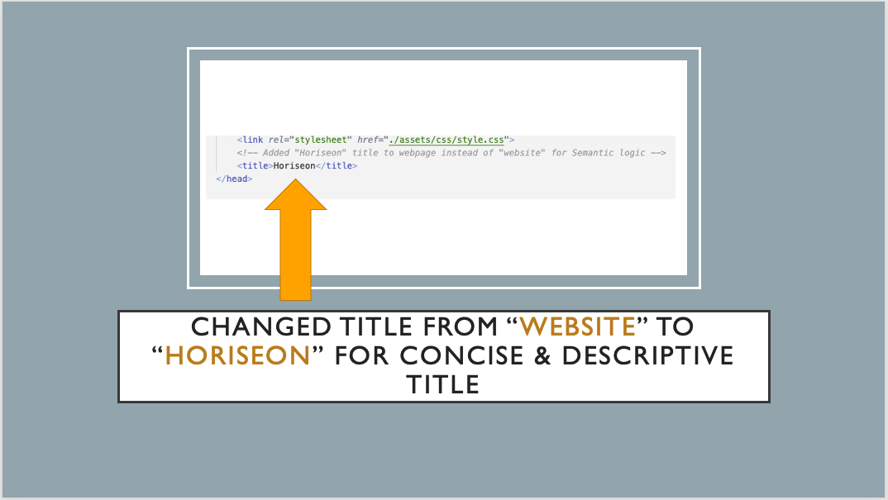
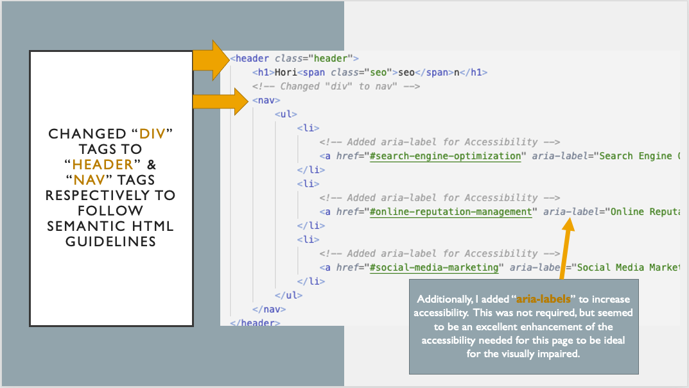
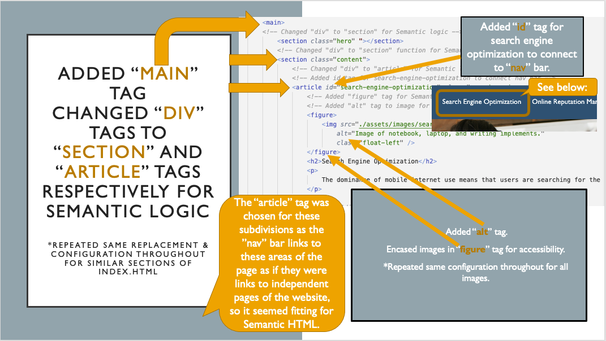
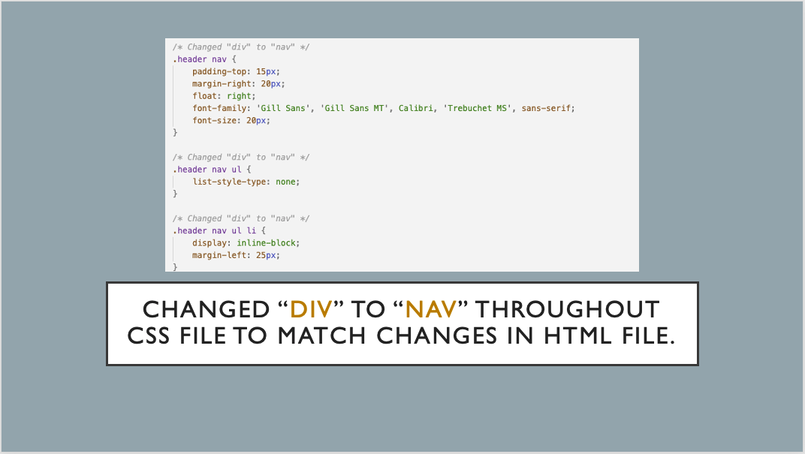
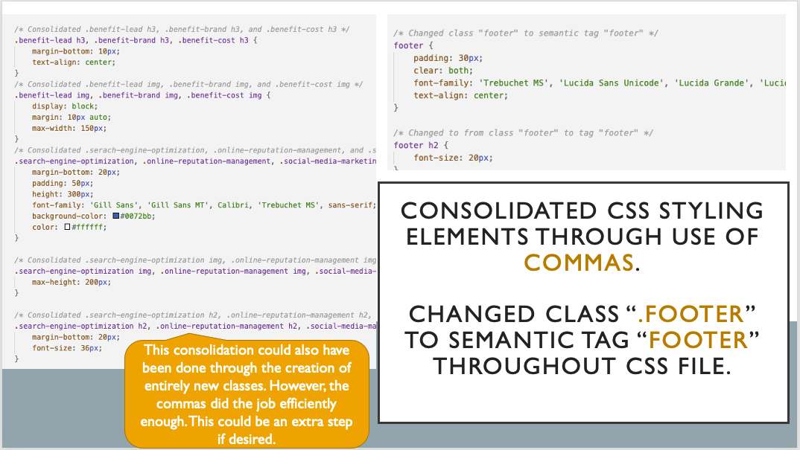

# Refactored_Code
## Description

- What was my motivation? I needed to refactor the code for this webpage so that it followed Semantic HTML logic.
- Why did I build this project? I built this project to better understand the logic behind "Accessibiliy" and the art of consolidating CSS code.
- What problem does it solve? This project made this webpage "accessible" for search engines and voice readers.
- What did I learn? I learned which tags I need to use in HTML to make the document follow Semantic rules. I learned how to consolidate code in CSS.

## Table of Contents
If your README is long, add a table of contents to make it easy for users to find what they need.
- [Installation](#installation)
- [Usage](#usage)
- [Credits](#credits)
- [License](#license)
- [Links](#links)

## Installation
Although this is simply a refactored webpage and no installation is necessary, there were certain criteria that had to be met in order to complete this project:

    User Story

    AS A marketing agency

    I WANT a codebase that follows accessibility standards

    SO THAT our own site is optimized for search engines

    Acceptance Criteria
    
    GIVEN a webpage meets accessibility standards

    WHEN I view the source code

    THEN I find semantic HTML elements

    WHEN I view the structure of the HTML elements

    THEN I find that the elements follow a logical structure independent of styling and positioning

    WHEN I view the icon and image elements

    THEN I find accessible alt attributes

    WHEN I view the heading attributes

    THEN they fall in sequential order

    WHEN I view the title element

    THEN I find a concise, descriptive title
        
### Mock-Up

## Usage
- Please see below for information regarding the refactoring needed for this webpage:

## Credits
- https://www.internetingishard.com/html-and-css/semantic-html/
- https://du.bootcampcontent.com/denver-coding-bootcamp/du-den-virt-fsf-pt-08-2021-u-c/-/blob/master/01-Week_HTML-CSS/02-Homework/README.md
- https://coding-boot-camp.github.io/full-stack/github/professional-readme-guide

## License
© 2021 Trilogy Education Services, LLC, a 2U, Inc. brand. Confidential and Proprietary. All Rights Reserved.

## Links
[Live Link](https://carlincb.github.io/Refactored_Code/)

[GitHub Link](https://github.com/carlincb/Refactored_Code)